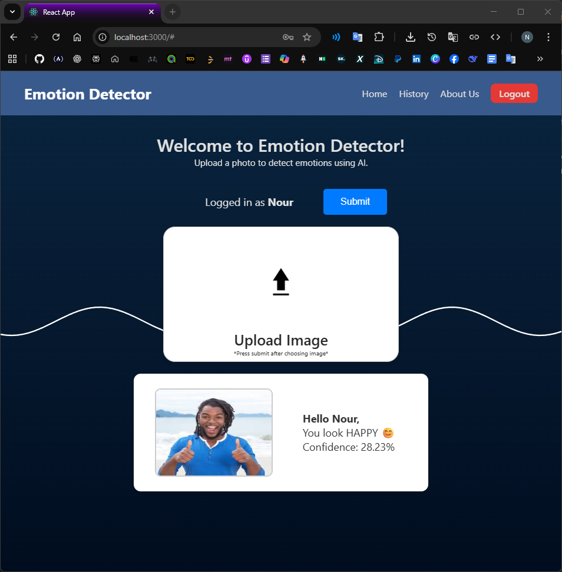
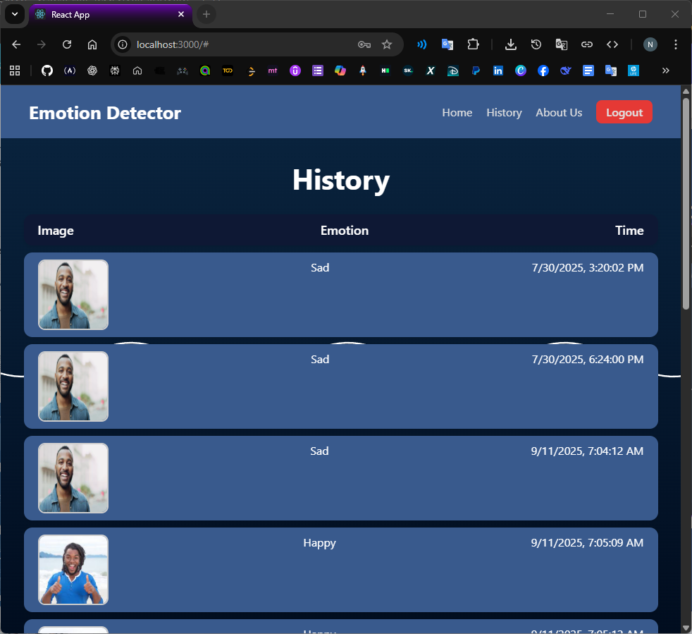

# 🎭 Emotion Detector

Emotion Detector is a full-stack AI web application that analyzes facial expressions in images to detect human emotions.  
It combines a **React frontend**, **FastAPI backend**, and a **deep learning emotion recognition model** to deliver a smooth and intuitive user experience.

---

## ✨ Features

- 🔐 User authentication (Sign up / Login / Logout)
- 🖼️ Upload images for emotion analysis
- 🤖 AI-based facial emotion recognition
- 📊 Emotion confidence score
- 🕒 Emotion history per user
- 🧾 Secure JWT-based API
- 🎨 Clean and responsive UI

---

## 🧠 Supported Emotions

The model predicts one of the following emotions:

- Angry  
- Disgusted  
- Fear  
- Happy  
- Sad  
- Surprise  
- Neutral  

---

## 🏗️ System Architecture

```text
emotion-detector/
│
├── backend/                # FastAPI backend
│   ├── main.py
│   ├── database.py
│   └── users.db            # SQLite database (auto-created)
│
├── model/
│   └── face_model.h5       # Trained emotion detection model
│
├── src/                    # React frontend
├── public/
│
├── ui-screenshots/         # UI images used in this README
│
├── package.json
└── README.md
```

---

## 🛠️ Tech Stack

### Frontend
- React (Create React App)
- Axios
- HTML / CSS / JavaScript

### Backend
- FastAPI
- Uvicorn
- SQLite
- JWT Authentication
- Passlib (bcrypt)

### Machine Learning
- TensorFlow / Keras
- Convolutional Neural Network (CNN)
- Grayscale facial images (48×48)

---

## 🚀 Getting Started

### Prerequisites
- **Python 3.11**
- **Node.js (LTS)**
- npm

---

## 🔧 Backend Setup (FastAPI)

```bash
# From project root
python -m venv .venv
.venv\Scripts\activate   # Windows

cd backend
pip install -r requirements.txt
uvicorn main:app --reload
```

### Backend runs at:
```
http://127.0.0.1:8000
```

### API documentation:
```
http://127.0.0.1:8000/docs
```

---

## 🌐 Frontend Setup (React)
```bash
# From project root
npm install
npm start
```

### Frontend runs at:
```
http://localhost:3000
```

---

## 🔐 Authentication Flow

1. User signs up
2. User logs in
3. Backend returns a JWT token
4. Token is stored client-side
5. Authenticated requests include:
    Authorization: Bearer <token>

--- 

## 🖼️ Application Screenshots

### 🏠 Home & Authentication
<p float="left">
  
</p>

---

### 🤖 Emotion Detection Flow
<p float="left">
  
</p>

---

### 📜 History
<p float="left">
  
</p>


---

## 📦 Database

- **SQLite**
- Database file: `users.db`
- Automatically created on first backend run
- Stores:
  - Users
  - Encrypted passwords
  - Emotion analysis history
  - Uploaded images (BLOBs)

---

## 🎯 Use Cases

- Emotion-aware applications
- Human-computer interaction demos
- AI-powered image analysis
- Portfolio and academic projects

---

## ⚠️ Notes

- TensorFlow requires **Python 3.10 or 3.11**
- CPU inference supported (GPU optional)
- Image upload endpoints require authentication

---

## 📌 Future Improvements

- Real-time webcam emotion detection
- Face detection before emotion classification
- Improved confidence visualization
- Dockerized deployment
- Cloud hosting (AWS / GCP)
